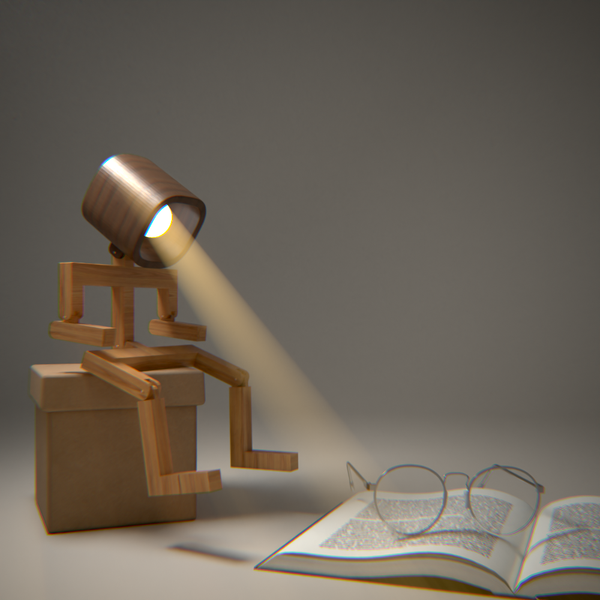

# Robot Lamp

*A small machine. One job: keep the light steady over an open book.*


---

## About

This is a character study, not just a prop. A desk lamp reimagined as a quiet sci-fi companion whose entire purpose is to light the page in front of it. No backstory required — the personality comes through in the pose, the proportions, and the way it leans toward whatever it's illuminating.

Modeled, rigged, and rendered entirely in **Blender 5.1**, with the final look path-traced in **Cycles**.

## Preview

<p align="center">
  
</p>

## Details

| | |
|---|---|
| Software | Blender 5.1 |
| Render engine | Cycles (final render) · EEVEE (viewport preview) |
| Rig | 6 armatures — full body |
| Materials | Titanium metal, Glossy, Black metal, Plastic |
| Theme | Character-driven, sci-fi |

## Rig & posing

The lamp is fully rigged for expressive posing — head, arms, and legs all articulate independently. That's what lets it lean in toward the book rather than sit like a static prop. Drop it into Pose Mode and it reads as a character, not a fixture.

## Project structure

```
Project/
├── Robot Lamp.blend     main scene file
├── assets/              textures and reference material
├── 1.png – 4.png        preview renders
```

## Opening this project

1. Clone the repository.
2. Open `Robot Lamp.blend` in Blender 4.1 or later.
3. The render engine is already set to Cycles — hit render to reproduce the final look, or switch to EEVEE for fast iteration.
